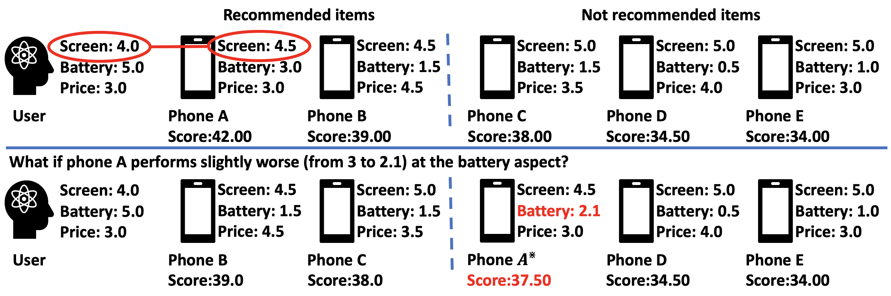

## Overall
Pytorch implementation for paper 
"Counterfactual Explainable Recommendation".


### Paper link: 
https://arxiv.org/abs/2108.10539

## Requirements
- Python 3.7
- pytorch 1.1.0
- cuda 9

## Instruction
1. Before running the experiments, please set the "--review_dir" and "--sentires_dir" arguments to the paths of the review dataset and extracted sentiment dataset. We provide default parameter settings in the /utils folder.\
You may download Amazon Review dataset from https://jmcauley.ucsd.edu/data/amazon/ and Yelp Review dataset from https://www.yelp.com/dataset.
2. The sentiment data are extracted with "Sentires" tool https://github.com/evison/Sentires. A python guide can be found in https://github.com/lileipisces/Sentires-Guide. You can also use any linguistic tool to extract such data. 
3. We provide an example on "Cell Phones and Accessories" datasets. The pre-extracted sentiment data are already in the dataset/Cell_Phones_and_Accessories" folder, but you have to download and place the review dataset by yourself due to github size limit.
4. To set the python path, under the project root folder, run:
    ```
    source setup.sh
    ```
5. To train the base recommender: run:
    ```
    python scripts/train_base_amazon.py
    ```
6. To generate explanations, run:
    ```
    python scripts/generate_exp_amazon.py
    ```
## Reference
If you find the method useful, please consider cite the paper:
```
@inbook{10.1145/3459637.3482420,
author = {Tan, Juntao and Xu, Shuyuan and Ge, Yingqiang and Li, Yunqi and Chen, Xu and Zhang, Yongfeng},
title = {Counterfactual Explainable Recommendation},
year = {2021},
isbn = {9781450384469},
url = {https://doi.org/10.1145/3459637.3482420},
booktitle = {Proceedings of the 30th ACM International Conference on Information & Knowledge Management},
pages = {1784–1793},
numpages = {10}
}
```
